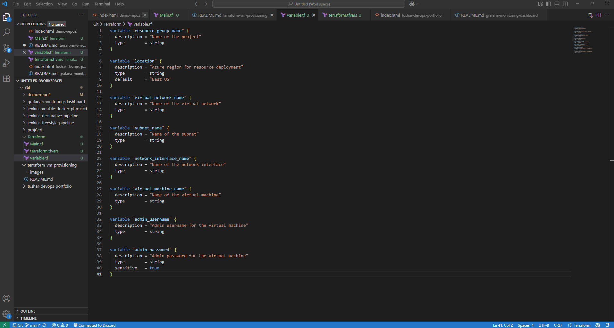
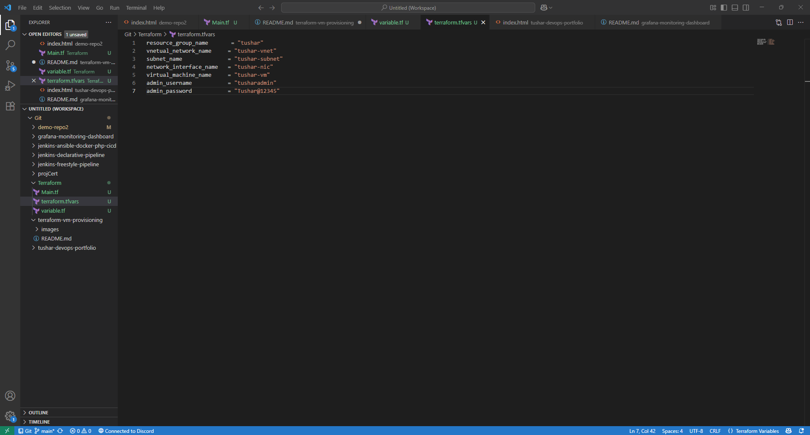

# ☁️ Terraform VM Provisioning

## 📌 Project Overview
This project demonstrates provisioning a Virtual Machine (VM) using Terraform, leveraging Infrastructure as Code (IaC) best practices. The infrastructure configuration is modular and parameterized with variables, allowing easy customization through the terraform.tfvars file.

---

## 🛠 Features
- Automated VM creation with Terraform  
- Parameterized input variables for flexibility and reuse
- Clean teardown of infrastructure resources
- Reproducible and consistent infrastructure setups 

---

## 📂 Repository Structure
    main.tf — Core VM configuration and resource definitions
    variables.tf — Input variable declarations for reusable parameters
    terraform.tfvars — Variable values for custom configuration
    images/  — Screenshots showing the setup and configuration

---

## 📸 Screenshots

### 1. Main Terraform File
*(Defines the core VM infrastructure)*  


### 2. Variables Definition
*(Reusable input variables for flexibility)*  


### 3. Terraform Variables File
*(Custom values for VM parameters)*  



---

## 🚀 How to Run

1. **Initialize Terraform**
   ```bash
   terraform init

2. **Preview Infrastructure Changes**
    ```bash
    terraform plan

3. **Apply Configuration**
    ```bash
    terraform apply -auto-approve

4. **Destroy Infrastructure**
    ```bash
    terraform destroy -auto-approve

## 🧰 Technologies

1. Terraform
2. Cloud Provider (Azure)

## ✅ Conclusion

This project highlights how Terraform can be utilized to define and manage VM infrastructure declaratively and modularly. It emphasizes the power of Infrastructure as Code (IaC) principles to achieve automated, consistent, and reproduciable deployments.